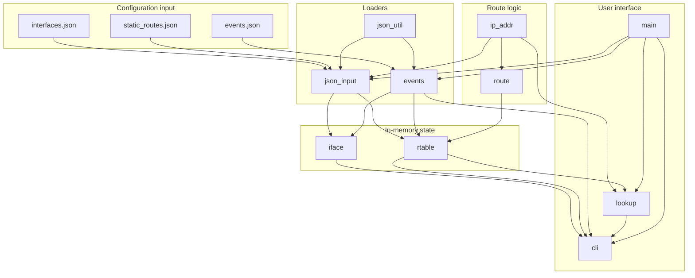

# virtual_routr — Design

This document describes the architecture of **virtual_routr**, a small IPv4 virtual router control plane written in C. The program models how a router builds and maintains a routing table, reacts to interface state changes, and selects routes using longest-prefix match (LPM).

**Scope:** configuration loading, route table maintenance, event replay, route lookup, and an interactive CLI.

**Out of scope:** packet forwarding, Ethernet/ARP/ICMP processing, raw sockets, TUN/TAP, and dynamic routing protocols.

---

## High-level architecture

The system is organized as a set of small, single-purpose modules. Data enters through JSON files, is stored in in-memory structures, and is queried through the lookup and CLI layers.



There is a single process, a single thread, and no persistence beyond JSON load/replay. All state lives in heap-allocated dynamic arrays that grow as entries are added.

---

## Module responsibilities

### `ip_addr`

**Purpose:** Provide the numeric foundation for all IPv4 work.

**Responsibilities:**
- Parse dotted-quad IPv4 strings into internal `vr_ipv4_t` values (host byte order)
- Convert prefix length to a subnet mask
- Compute network addresses
- Test whether an address belongs to a prefix

**Why it exists:** Routing logic depends on correct prefix arithmetic. Centralizing address parsing and bitmask operations prevents duplicated, error-prone code across loaders, route builders, and lookup.

---

### `route`

**Purpose:** Define the route entry data model and helpers to construct individual routes.

**Responsibilities:**
- Represent a route as `vr_route_t` (type, prefix, prefix length, next hop, interface, active flag)
- Build connected routes from an interface address and prefix
- Build static routes from configuration fields
- Test whether a destination matches a route prefix

**Why it exists:** Separates the *shape* of a route from the *collection* of routes. `rtable` manages the table; `route` defines what a single entry means and how it is normalized (e.g. network address derivation).

---

### `iface`

**Purpose:** Maintain the router's interface list and UP/DOWN state.

**Responsibilities:**
- Store interface name, IPv4 address, prefix length, and UP/DOWN flag
- Create interfaces and update state by name
- Enumerate and look up interfaces

**Why it exists:** Interfaces are the source of connected routes and the trigger for route activation/deactivation. Keeping interface state in its own module gives events and the routing table a single place to read and update link state.

---

### `rtable`

**Purpose:** Own the routing table — the central data structure of the project.

**Responsibilities:**
- Store connected and static routes in a dynamic array
- Add routes and list them by index
- Derive connected routes from all interfaces (`vr_rtable_sync_connected`)
- Refresh a connected route when an interface changes (`vr_rtable_on_iface_change`)
- Perform longest-prefix match over active routes (`vr_rtable_lpm`)

**Why it exists:** This is the core of the assessment: maintain a unified table, react to interface changes, and answer "which route wins?" for a destination.

---

### `lookup`

**Purpose:** Provide a user-facing lookup API and explain routing decisions.

**Responsibilities:**
- Wrap `vr_rtable_lpm()` as `vr_lookup_route()`
- Print the selected route
- Explain LPM by listing each active route, whether it matched, and why the winner was chosen

**Why it exists:** Lookup explanation is a distinct concern from table maintenance. Keeping it separate keeps `rtable` focused on storage and selection, while `lookup` handles presentation and diagnostics required by the assessment.

---

### `json_util`

**Purpose:** Shared, minimal JSON parsing utilities.

**Responsibilities:**
- Read JSON files into memory
- Locate arrays by key name
- Iterate objects in an array
- Extract string and unsigned integer fields from objects

**Why it exists:** Both `json_input` and `events` consume JSON with the same low-level patterns. A shared utility avoids maintaining two copies of identical parsing code.

---

### `json_input`

**Purpose:** Load interfaces and static routes from JSON into application structures.

**Responsibilities:**
- Parse `interfaces.json` and populate `vr_ifaces_t`
- Parse `static_routes.json` and append static routes to `vr_rtable_t`
- Set static route active flags based on whether the outbound interface is UP at load time

**Why it exists:** Isolates file format knowledge from interface and routing table logic. If the JSON schema changes, only this module (and sample data) need to change.

---

### `events`

**Purpose:** Load and replay interface UP/DOWN events.

**Responsibilities:**
- Parse `events.json` into an ordered event list
- Sort events by sequence number
- Apply each event: update interface state, refresh the connected route, print progress
- Support full replay (`vr_events_replay_all`)

**Why it exists:** Event replay is how the assessment tests dynamic behavior (interface failures and recovery). Encapsulating the apply path ensures startup replay and CLI `replay` share the same logic.

---

### `cli`

**Purpose:** Interactive command-line interface after startup.

**Responsibilities:**
- Read commands from stdin
- Dispatch to existing modules for `show interfaces`, `show routes`, `lookup`, and `replay`
- Print help and handle quit

**Why it exists:** The assessment requires a CLI for inspection and manual testing. The CLI is a thin layer that calls into `iface`, `rtable`, `lookup`, and `events` rather than reimplementing their logic.

---

### `main`

**Purpose:** Program entry point and orchestration.

**Responsibilities:**
- Parse command-line options (`-i`, `-r`, `-e`, `-p`, `-d`)
- Run the startup sequence: load → sync connected routes → load static routes → replay events
- Optionally print tables or run a one-shot lookup
- Start the interactive CLI

**Why it exists:** Wires modules together without embedding business logic. All routing behavior remains in the dedicated modules above.

---

## Data flow

### Startup

```
interfaces.json ──► json_input ──► iface
                         │
                         ▼
                   rtable.sync_connected()
                         │
static_routes.json ──► json_input ──► rtable (static routes)
                         │
events.json ──► events.load()
                         │
                         ▼
                   events.replay_all()
                         │
                         ├──► iface.set_state()
                         └──► rtable.on_iface_change()
                         │
                         ▼
                   cli.run()  /  lookup.explain()  (optional -d)
```

### Lookup (CLI or `-d`)

```
user IP string ──► ip_addr.parse()
                         │
                         ▼
                   lookup.route() ──► rtable.lpm()
                         │
                         ▼
                   lookup.explain() ──► print match details + winner
```

### Event replay (startup or CLI `replay`)

```
events.json ──► events.load() ──► sorted event list
                         │
            for each event (by seq):
                         │
                         ├──► iface.set_state(up/down)
                         └──► rtable.on_iface_change()
                                   │
                                   └──► update connected route active flag
```

---

## Routing table design

### Route entry (`vr_route_t`)

Each route stores:

| Field | Meaning |
|-------|---------|
| `type` | `VR_ROUTE_CONNECTED` or `VR_ROUTE_STATIC` |
| `prefix` | Destination network (normalized to network address) |
| `prefix_len` | Prefix length (0–32) |
| `next_hop` | Next-hop IPv4 address (static routes only) |
| `has_next_hop` | Whether `next_hop` is valid |
| `iface` | Outgoing interface name |
| `active` | Whether the route participates in LPM |

Connected routes are on-link: they have no next hop. Static routes always carry a next hop from configuration.

### Table storage (`vr_rtable_t`)

Routes are stored in a dynamic array (`routes`, `count`, `capacity`). New routes are appended; capacity doubles when full (initial capacity 8).

There is no separate index or trie. For the small tables used in this assessment, a linear scan is simple and sufficient.

### Connected route derivation

When interfaces are loaded or change state:

1. For each interface, find or create the connected route keyed by interface name
2. Set prefix to `network(address, prefix_length)`
3. Set `active = interface.up`

Each interface owns exactly one connected route. The route remains in the table when the interface goes DOWN; it becomes inactive rather than being deleted.

### Static routes

Static routes are loaded once from JSON and appended to the table. At load time, a static route is marked active if its outbound interface is UP.

Static routes are **not** automatically deactivated when an interface later goes DOWN via event replay. Only connected routes track live interface state through `vr_rtable_on_iface_change()`.

---

## Longest-prefix-match algorithm

LPM is implemented in `vr_rtable_lpm()` as a linear scan with a running best match.

**Input:** destination address `dest`

**Output:** pointer to the best matching active route, or `NULL`

**Algorithm:**

```
best ← NULL
for each route in table:
    if not route.active:
        continue
    if not route_matches(route, dest):
        continue
    best ← pick_better_match(best, route)
return best
```

**Match test (`vr_route_matches`):** destination is in the route prefix if `(dest & mask) == (route.prefix & mask)`.

**Tie-breaking (`pick_better_match`):**

1. Prefer the route with the **longer** `prefix_len`
2. If prefix lengths are equal, prefer **static** over **connected**
3. Otherwise keep the current best (first in table wins)

Only **active** routes are considered. An inactive connected route on a DOWN interface is skipped entirely, allowing a shorter active route (e.g. a default route) to win.

**Lookup explanation (`vr_lookup_explain`):** runs the same LPM, then prints every active route with its prefix length and whether it matched, followed by the selected route and a summary reason.

---

## Event replay flow

Events model interface UP/DOWN changes over time. They are the only mechanism that mutates interface state after initial load.

### Event record (`vr_event_t`)

| Field | Meaning |
|-------|---------|
| `seq` | Sequence number for ordering |
| `type` | `VR_EVENT_IFACE_UP` or `VR_EVENT_IFACE_DOWN` |
| `interface` | Target interface name |

### Load

1. Read `events.json`
2. Parse each object in the `"events"` array
3. Append to a dynamic array
4. Sort by `seq` ascending
5. Reset replay cursor (`next_index = 0`)

### Apply (single event)

```
apply_event(event):
    print event details
    iface.set_state(event.interface, up/down)
    rtable.on_iface_change(event.interface)
```

`vr_rtable_on_iface_change()` looks up the interface, then upserts its connected route with the current address, prefix, and active flag.

### Replay all

```
while replay_next() returns 1:
    apply next event
```

Returns `0` when all events are consumed, or `-1` on error.

Startup calls `vr_events_replay_all()` once. The CLI `replay` command reloads the events file (clearing the previous list) and runs replay again from the beginning.

---

## Layering and dependencies

```
main
 ├── cli ──────► iface, rtable, lookup, events
 ├── json_input ► json_util, iface, rtable, ip_addr
 ├── events ───► json_util, iface, rtable
 └── lookup ───► rtable, route, ip_addr

rtable ──► iface, route ──► ip_addr
```

**Design principles used:**

- **Single responsibility:** each module owns one concern (addresses, interfaces, routes, table, lookup, I/O)
- **No circular dependencies:** lower layers (`ip_addr`, `route`) do not depend on higher layers
- **Reuse over duplication:** JSON parsing is shared; CLI and `main` call module APIs instead of reimplementing logic
- **Explicit state:** route `active` flags and interface `up` flags make LPM behavior observable and testable
- **In-memory simplicity:** no threads, no persistence, no network I/O beyond reading JSON files

---

## What this design deliberately omits

| Omitted | Reason |
|---------|--------|
| Packet forwarding | Assessment focuses on the control plane |
| Trie/patricia tree for LPM | Linear scan is adequate for small tables |
| Dynamic routing protocols | Static configuration only |
| Static route deactivation on iface DOWN | Simplified scope; connected routes track live state |
| Persistence / checkpointing | State is rebuilt from JSON on each run |

These omissions keep the codebase small and focused on the assessment requirements: load configuration, maintain a routing table, react to events, perform LPM, and explain decisions.
