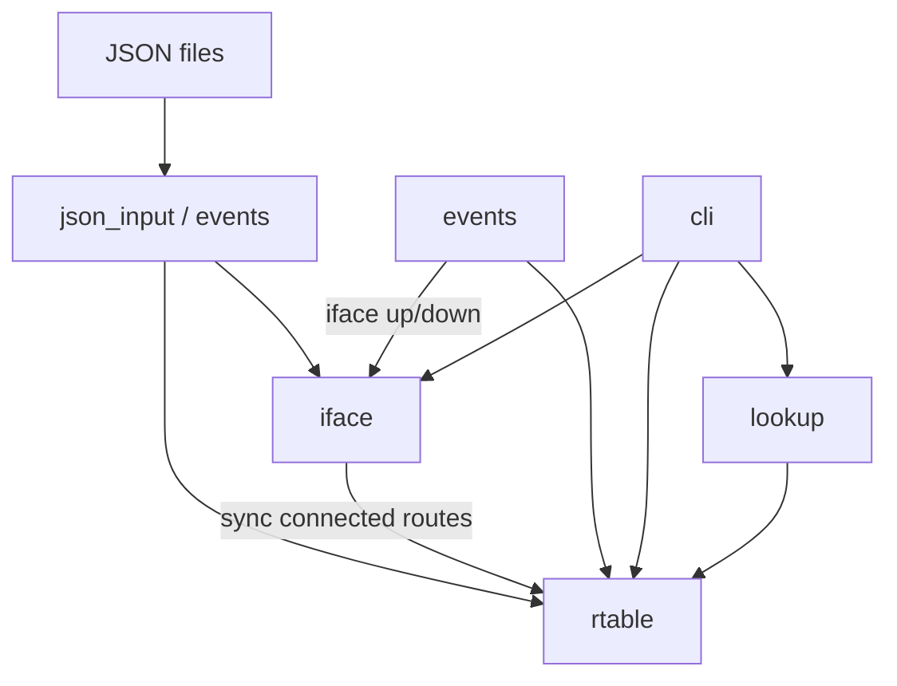

# virtual_routr

A small IPv4 virtual router **control plane** in C for Linux. The program loads interfaces and routes from JSON, derives connected routes, replays interface UP/DOWN events, maintains an in-memory routing table, performs longest-prefix match (LPM) lookups, and explains routing decisions.

There is no data plane: no Ethernet processing, ARP, ICMP, packet forwarding, raw sockets, or TUN/TAP.

## Architecture

At startup the program loads configuration, builds the routing table, replays events from JSON, optionally prints state or runs a one-shot lookup, then enters an interactive CLI.



**Startup sequence**

1. Load interfaces from JSON into `iface`
2. Derive connected routes with `vr_rtable_sync_connected()`
3. Load static routes from JSON into `rtable`
4. Load and replay events (updates interface state and connected routes)
5. Optionally print tables (`-p`) or run a lookup (`-d`)
6. Enter the interactive CLI

**Routing rules**

- Each interface gets one connected route from its address and prefix length
- Connected routes are **active** when the interface is UP, **inactive** when DOWN
- Static routes are loaded once; their active flag reflects the outbound interface state at load time
- LPM considers **active routes only**; the longest matching prefix wins (static beats connected on a tie)

## Project layout

```
virtual_routr/
├── Makefile
├── README.md
├── data/
│   ├── interfaces.json
│   ├── static_routes.json
│   └── events.json
├── include/
│   ├── cli.h
│   ├── events.h
│   ├── iface.h
│   ├── ip_addr.h
│   ├── json_input.h
│   ├── json_util.h
│   ├── lookup.h
│   ├── route.h
│   └── rtable.h
└── src/
    ├── cli.c
    ├── events.c
    ├── iface.c
    ├── ip_addr.c
    ├── json_input.c
    ├── json_util.c
    ├── lookup.c
    ├── main.c
    ├── route.c
    └── rtable.c
```

## Module responsibilities

| Module | Files | Responsibility |
|--------|-------|----------------|
| `ip_addr` | `ip_addr.c/h` | Parse IPv4 strings; prefix/mask math; network membership tests |
| `route` | `route.c/h` | Route entry model; build connected and static route structs |
| `iface` | `iface.c/h` | In-memory interface list; UP/DOWN state; lookup by name |
| `rtable` | `rtable.c/h` | Routing table storage; add routes; LPM; sync connected routes on interface changes |
| `lookup` | `lookup.c/h` | Route lookup wrapper; print selected route and LPM explanation |
| `json_util` | `json_util.c/h` | Shared minimal JSON parsing helpers (internal to loaders) |
| `json_input` | `json_input.c/h` | Load interfaces and static routes from JSON files |
| `events` | `events.c/h` | Load events from JSON; apply UP/DOWN; replay event sequences |
| `cli` | `cli.c/h` | Interactive command loop; display interfaces and routes |
| `main` | `main.c` | Argument parsing; startup wiring; orchestration |

## Build

Requirements: a C11 compiler (`gcc` or `clang`).

```bash
make
```

The binary is written to `build/virtual_routr`.

```bash
make clean
```

Compiler flags can be overridden, for example:

```bash
make CC=clang CFLAGS='-Wall -Wextra -std=c11 -Iinclude -g'
```

## Command-line usage

```bash
./build/virtual_routr [options]
```

| Option | Default | Description |
|--------|---------|-------------|
| `-i <file>` | `data/interfaces.json` | Interface definitions |
| `-r <file>` | `data/static_routes.json` | Static routes |
| `-e <file>` | `data/events.json` | Event sequence to replay at startup |
| `-p` | off | Skip the pre-replay table dump; still prints tables after replay |
| `-d <IPv4>` | — | One-shot LPM lookup with explanation after startup |
| `-h`, `--help` | — | Print usage and exit |

Without `-p`, interfaces and routes are printed **before** and **after** event replay. With `-p`, they are printed only once after replay.

After startup the program always enters the interactive CLI.

## CLI commands

| Command | Description |
|---------|-------------|
| `show interfaces` | List all interfaces with address, prefix, and UP/DOWN state |
| `show routes` | List the full routing table (connected and static) |
| `lookup <ip>` | Run LPM for `<ip>` and print an explanation of the result |
| `replay` | Reload and replay events from the events JSON file |
| `help` | List available commands |
| `quit`, `exit`, `q` | Exit the program |

Example lookup output:

```
Route lookup for 203.0.113.5:
  connected  192.168.1.0/24  prefix_len=24  matched=no
  connected  10.0.0.0/24  prefix_len=24  matched=no
  connected  172.16.0.0/16  prefix_len=16  matched=no
  static  0.0.0.0/0  prefix_len=0  matched=yes
  static  203.0.113.0/24  prefix_len=24  matched=yes
Selected route:
  static  203.0.113.0/24  iface=eth1  active  via 10.0.0.254
Reason: longest prefix match (/24 is the longest matching prefix among active routes).
```

## JSON formats

### `interfaces.json`

```json
{
  "interfaces": [
    {
      "name": "eth0",
      "address": "192.168.1.1",
      "prefix_length": 24,
      "state": "up"
    }
  ]
}
```

| Field | Type | Description |
|-------|------|-------------|
| `name` | string | Interface name (max 15 characters) |
| `address` | string | IPv4 address in dotted-quad notation |
| `prefix_length` | integer | Prefix length (0–32) |
| `state` | string | `"up"` or `"down"` |

### `static_routes.json`

```json
{
  "routes": [
    {
      "prefix": "0.0.0.0",
      "prefix_length": 0,
      "next_hop": "192.168.1.254",
      "interface": "eth0"
    }
  ]
}
```

| Field | Type | Description |
|-------|------|-------------|
| `prefix` | string | Destination network address |
| `prefix_length` | integer | Prefix length (0–32) |
| `next_hop` | string | Next-hop IPv4 address |
| `interface` | string | Outbound interface name |

### `events.json`

```json
{
  "events": [
    {
      "seq": 1,
      "type": "iface_down",
      "interface": "eth1"
    }
  ]
}
```

| Field | Type | Description |
|-------|------|-------------|
| `seq` | integer | Sequence number (events are sorted by `seq` before replay) |
| `type` | string | `"iface_up"` or `"iface_down"` |
| `interface` | string | Target interface name |

## Example runs

### Default startup with sample data

```bash
make
./build/virtual_routr -p
```

Prints final interfaces and routes after replaying three events, then drops into the CLI:

```
Replaying 3 event(s)...
event seq=1 type=iface_down interface=eth1
event seq=2 type=iface_up interface=eth2
event seq=3 type=iface_up interface=eth1
Interfaces (3):
  eth0  192.168.1.1/24  up
  eth1  10.0.0.1/24  up
  eth2  172.16.0.1/16  up
Routes (5):
  connected  192.168.1.0/24  iface=eth0  active
  connected  10.0.0.0/24  iface=eth1  active
  connected  172.16.0.0/16  iface=eth2  active
  static  0.0.0.0/0  iface=eth0  active  via 192.168.1.254
  static  203.0.113.0/24  iface=eth1  active  via 10.0.0.254
Type 'help' for commands.
vr>
```

### One-shot lookup from the command line

```bash
./build/virtual_routr -p -d 203.0.113.5
```

Runs startup, prints final tables, prints the lookup explanation, then enters the CLI.

### Interactive lookup

```bash
./build/virtual_routr -p
```

```
vr> lookup 192.168.1.50
Route lookup for 192.168.1.50:
  connected  192.168.1.0/24  prefix_len=24  matched=yes
  ...
Selected route:
  connected  192.168.1.0/24  iface=eth0  active
Reason: longest prefix match (/24 is the longest matching prefix among active routes).
vr> q
```

### Custom config paths

```bash
./build/virtual_routr \
  -i data/interfaces.json \
  -r data/static_routes.json \
  -e data/events.json
```
